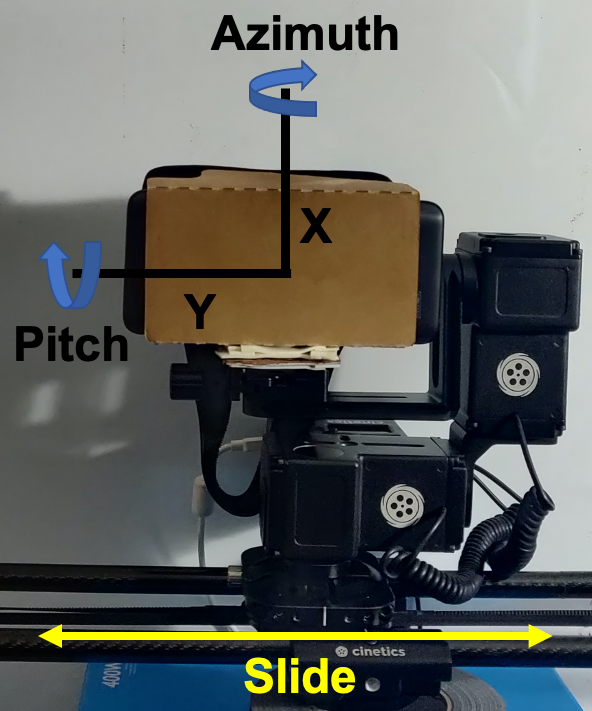

# Throughput Prediction on 60 GHz Mobile Devices for High-Bandwidth, Latency-Sensitive Applications
Data from our PAM 2021 publication used for throughput prediction in static and mobile scenarios

If you use this dataset in your publication, please cite us as follows:

```
@InProceedings{aggarwal:pam2021,
author={Aggarwal, Shivang and Kong, Zhaoning and Ghoshal, Moinak and Hu, Y. Charlie and Koutsonikolas, Dimitrios},
title={Throughput Prediction on 60 GHz Mobile Devices for High-Bandwidth, Latency-Sensitive Applications},
booktitle={Passive and Active Measurement (PAM)},
year={2021}
}
```

Each folder contains file(s) totalling 10 hours of throughput data under 3 scenarios:

1. Static (Section 3.2)
2. Mobile (Section 3.3)
3. Applications (Section 3.4)<br>
  a. VR<br>
  b. ABR

Please refer to the corresponding sections in the paper for more details regarding the scenarios.

Each file contains the following data for every 10 ms (each row):

* Android sensor data
  * Positional data (Azimuth, Pitch, Roll)
  * Accelerometer data (along x-, y- and z-axes)
* 60 GHz link data (reported by the wil6210 driver)
  * MCS
  * Tx Sector
  * Link Status
  * Signal Quality Indicator (SQI)
  * RSSI

## Hardware Setup

Below is an image of the device setup used to collect this dataset.


                   
As can be seen, the smartphone ([ASUS ROG Phone II](https://rog.asus.com/us/phones/rog-phone-ii-model/)) is placed in a [Google Cardboard VR Headset](https://arvr.google.com/cardboard/). There are basically 3 dimensions of motion for the smartphone.

1) Rotation w.r.t. the Azimuth axis (X-axis in figure)
2) Rotation w.r.t. the Pitch axis (Y-axis in figure)
3) Translation motion along the Slide axis

This setup which allows us to simulatenously move the smartphone in all 3 dimensions is enabled by using the [Cinetics Lynx 3-Axis Slider](https://cinetics.com/lynx-3-axis-slider/).
